

# Vita_plex

**A cross-platform client for Plex**

## 📊 Feature Comparison

| Feature | Alpha 0.0.1 | Current Build |
|---|---|---|
| UI Framework | vita2d + custom text menus | Borealis (NanoVG + GXM) |
| Navigation | Linear list menus | Sidebar tabs + activity stack |
| Library Browse | Text list with `[M]/[T]/[A]` tags | Poster grid with All / Categories |
| Cover Art | Music only | Movies, TV, Music, Music Videos |
| Audio Playback | SceAvPlayer (basic) | MPV with `ao=vita` driver |
| Video Playback | SceAvPlayer (basic) | MPV HLS/MPEG-TS pipeline |
| Music Queue | ❌ | ✅ Drag / swipe / LB-RB reorder |
| Offline Downloads | ❌ | ✅ Movies, Shows, Music |
| Live TV | Empty-state only | Full program guide + DVR |
| Search | Text list | Typed, grouped results with art |
| Settings | Minimal | UI / Layout / Playback / Music / Transcoding / Downloads / Debug |
| Auth | Credentials | PIN + Credentials + multi-server auto-detect |
| Subtitles | ❌ | ✅ Toggle + size selection |
| Controller Navigation | Manual wiring | Automatic D-pad / stick focus |
| Touch Support | Limited | Full touchscreen |
| Tv Remote Support | None | Full Media Buttons |
| Supported Platforms| Vita | Linux, Mac, Windows, PS4, Vita, Switch, Andriod, Andriod TV |

---

---

<table>
  <tr>
    <th colspan="2" align="center"> Home Screen</th>
  </tr>
  <tr>
    <td align="center"><b>Alpha 0.0.1</b></td>
    <td align="center"><b>Current Build</b></td>
  </tr>
  <tr>
    <td>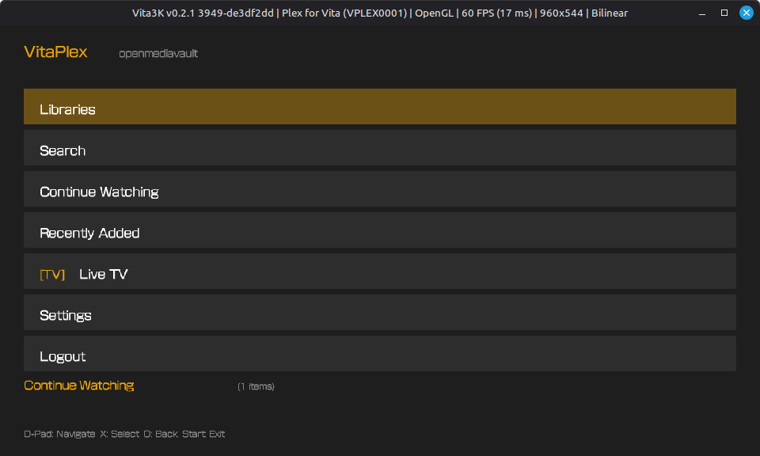</td>
    <td>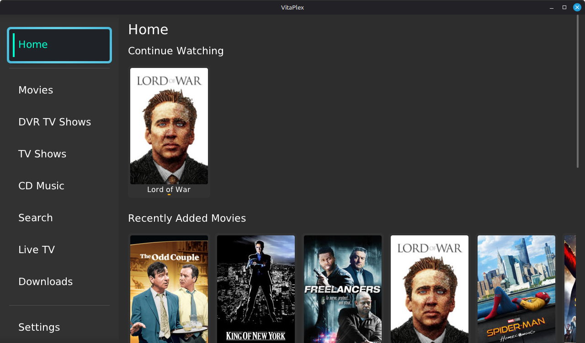</td>
  </tr>
</table>

<table>
  <tr>
    <th colspan="2" align="center"> Movies Libary</th>
  </tr>
  <tr>
    <td align="center"><b>Alpha 0.0.1</b></td>
    <td align="center"><b>Current Build</b></td>
  </tr>
  <tr>
    <td>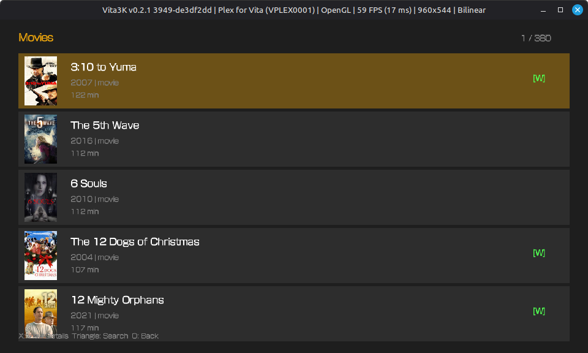</td>
    <td></td>
  </tr>
</table>

<table>
  <tr>
    <th colspan="2" align="center"> Movie Info</th>
  </tr>
  <tr>
    <td align="center"><b>Alpha 0.0.1</b></td>
    <td align="center"><b>Current Build</b></td>
  </tr>
  <tr>
    <td>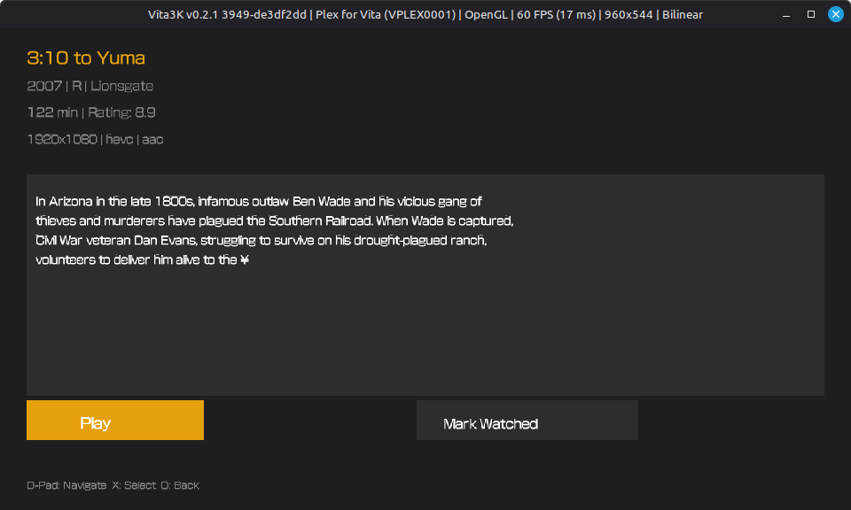</td>
    <td></td>
  </tr>
</table>

<table>
  <tr>
    <th colspan="2" align="center"> Music Libary</th>
  </tr>
  <tr>
    <td align="center"><b>Alpha 0.0.1</b></td>
    <td align="center"><b>Current Build</b></td>
  </tr>
  <tr>
    <td>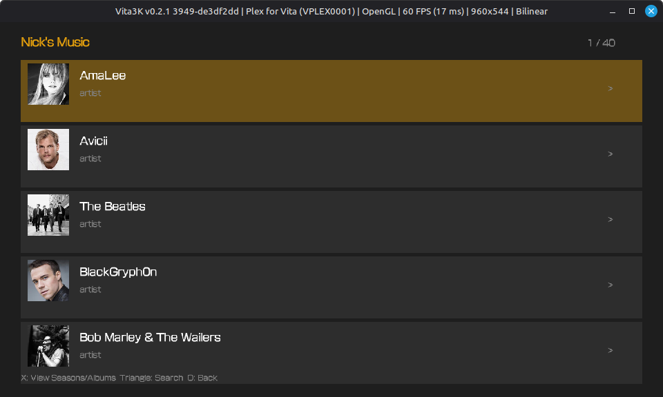</td>
    <td>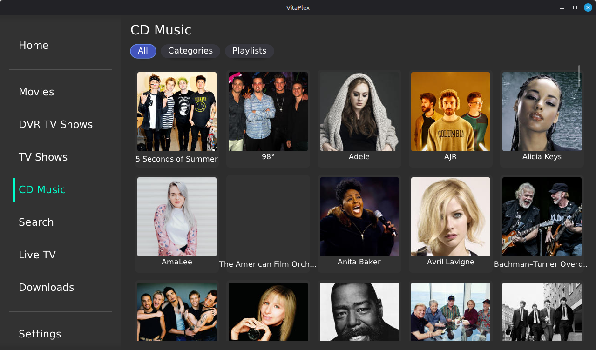</td>
  </tr>
</table>

<table>
  <tr>
    <th colspan="2" align="center">Album Page</th>
  </tr>
  <tr>
    <td align="center"><b>Alpha 0.0.1</b></td>
    <td align="center"><b>Current Build</b></td>
  </tr>
  <tr>
    <td>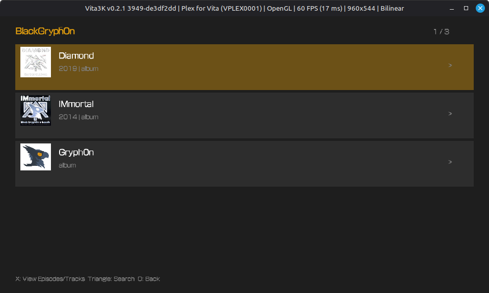</td>
    <td></td>
  </tr>
</table>

<table>
  <tr>
    <th colspan="2" align="center">Track List</th>
  </tr>
  <tr>
    <td align="center"><b>Alpha 0.0.1</b></td>
    <td align="center"><b>Current Build</b></td>
  </tr>
  <tr>
    <td>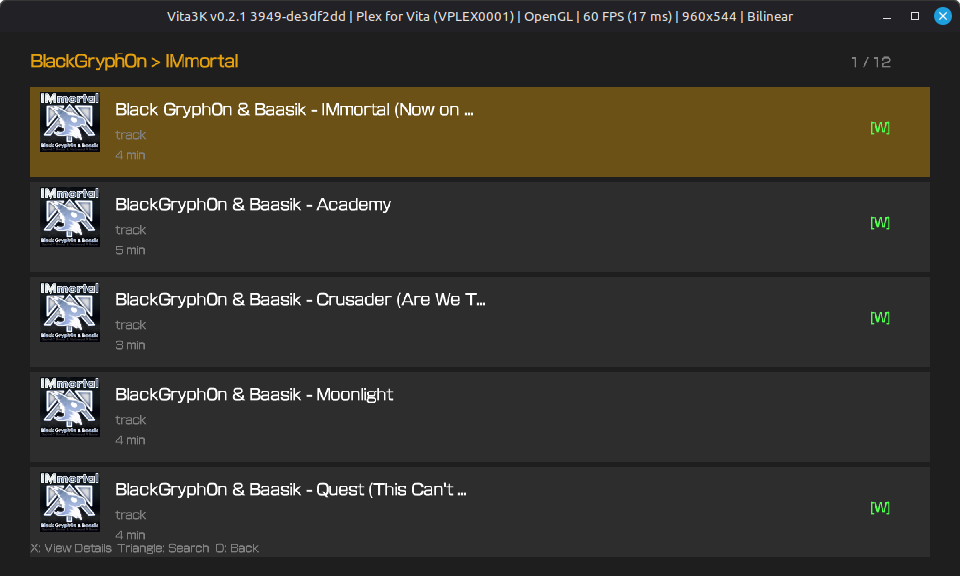</td>
    <td></td>
  </tr>
</table>

<table>
  <tr>
    <th colspan="2" align="center">Artist Download View</th>
  </tr>
  <tr>
    <td align="center"><b>Alpha 0.0.1 does not exist</b></td>
    <td align="center"><b>Current Build</b></td>
  </tr>
  <tr>
    <td></td>
    <td>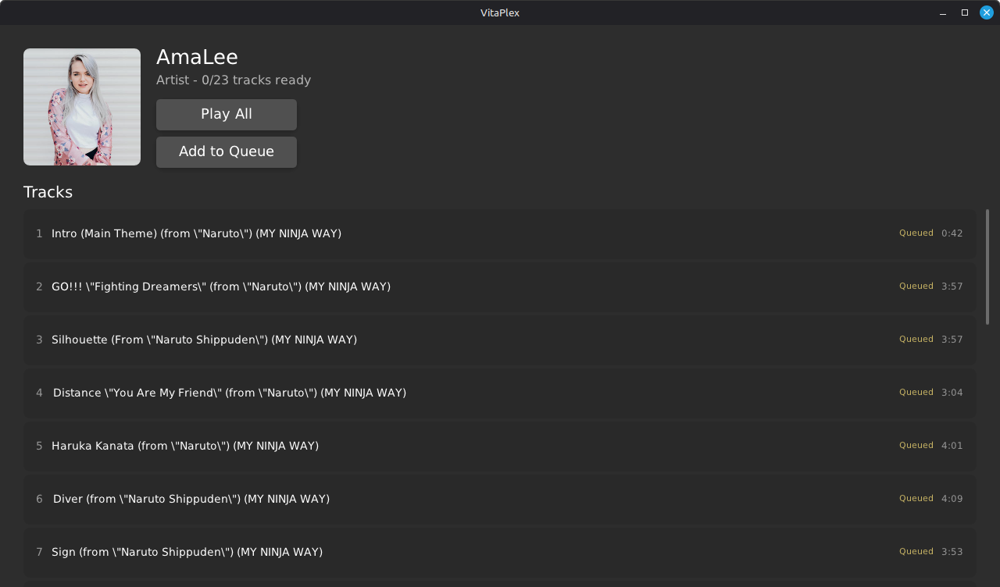</td>
  </tr>
</table>

<table>
  <tr>
    <th colspan="2" align="center">Music Player</th>
  </tr>
  <tr>
    <td align="center"><b>Alpha 0.0.1 </b></td>
    <td align="center"><b>Current Build</b></td>
  </tr>
  <tr>
    <td>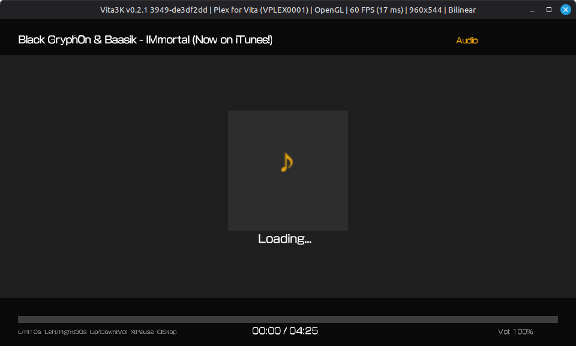</td>
    <td></td>
  </tr>
</table>

<table>
  <tr>
    <th colspan="2" align="center">Music Queue</th>
  </tr>
  <tr>
    <td align="center"><b>Alpha 0.0.1 does not exist</b></td>
    <td align="center"><b>Current Build</b></td>
  </tr>
  <tr>
    <td></td>
    <td></td>
  </tr>
</table>

<table>
  <tr>
    <th colspan="2" align="center">Video Player</th>
  </tr>
  <tr>
    <td align="center"><b>Alpha 0.0.1 </b></td>
    <td align="center"><b>Current Build</b></td>
  </tr>
  <tr>
    <td></td>
    <td></td>
  </tr>
</table>

<table>
  <tr>
    <th colspan="2" align="center">Downloads Tab</th>
  </tr>
  <tr>
    <td align="center"><b>Alpha 0.0.1 does not exist</b></td>
    <td align="center"><b>Current Build</b></td>
  </tr>
  <tr>
    <td></td>
    <td></td>
  </tr>
</table>

<table>
  <tr>
    <th colspan="2" align="center">Live TV / Program Guide</th>
  </tr>
  <tr>
    <td align="center"><b>Alpha 0.0.1</b></td>
    <td align="center"><b>Current Build</b></td>
  </tr>
  <tr>
    <td>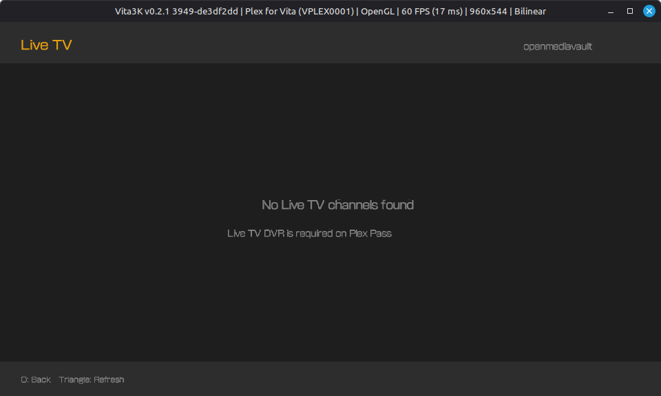</td>
    <td>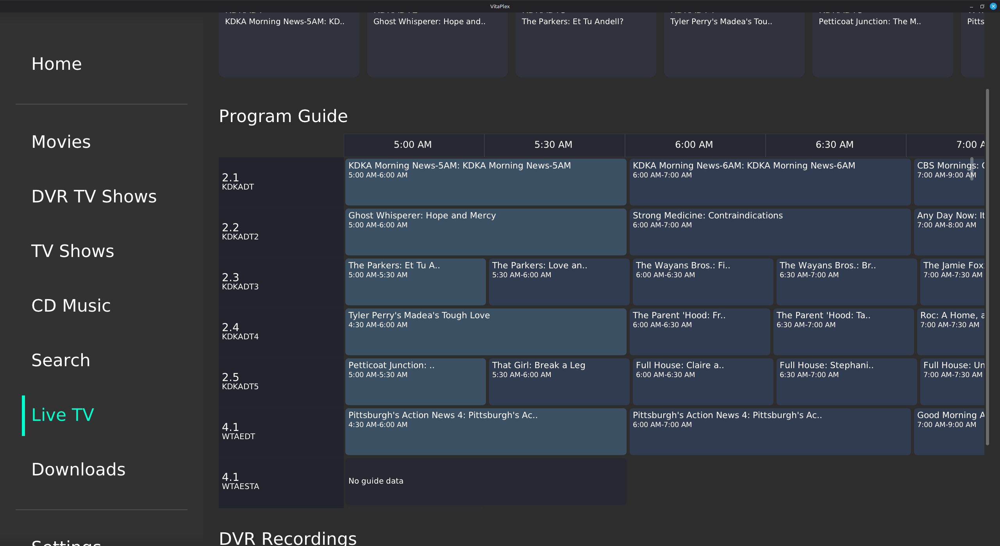</td>
  </tr>
</table>

<table>
  <tr>
    <th colspan="2" align="center">Search</th>
  </tr>
  <tr>
    <td align="center"><b>Alpha 0.0.1</b></td>
    <td align="center"><b>Current Build</b></td>
  </tr>
  <tr>
    <td>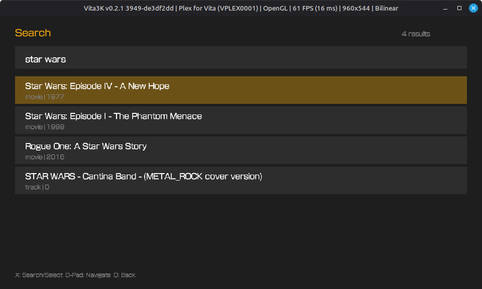</td>
    <td></td>
  </tr>
</table>

<table>
  <tr>
    <th colspan="2" align="center">Settings</th>
  </tr>
  <tr>
    <td align="center"><b>Alpha 0.0.1</b></td>
    <td align="center"><b>Current Build</b></td>
  </tr>
  <tr>
    <td>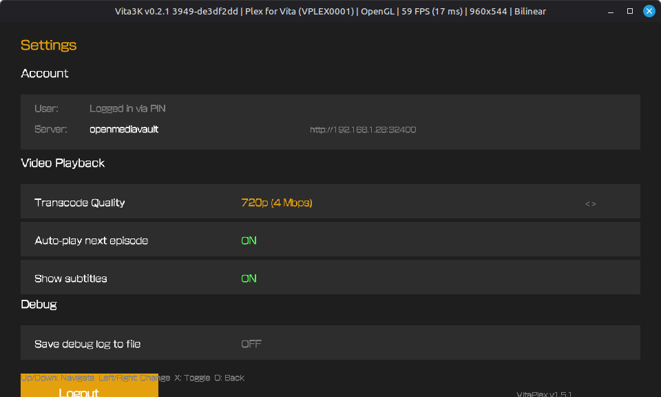</td>
    <td></td>
  </tr>
  <tr>
    <td></td>
    <td>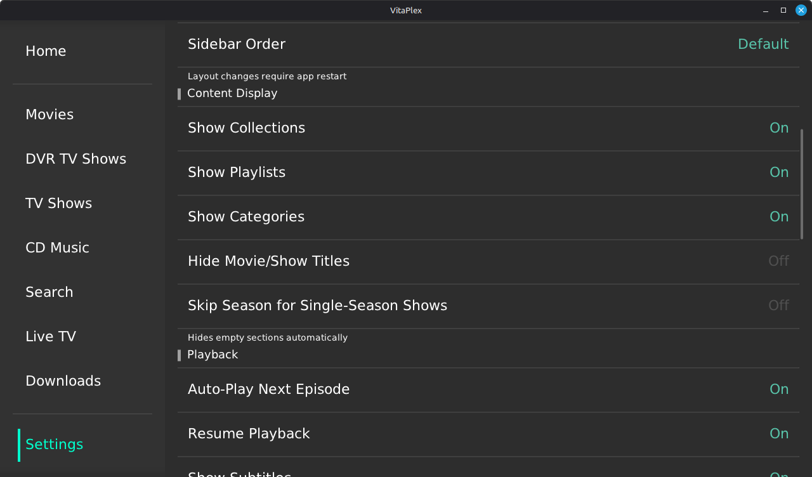</td>
  </tr>
   <tr>
    <td></td>
    <td>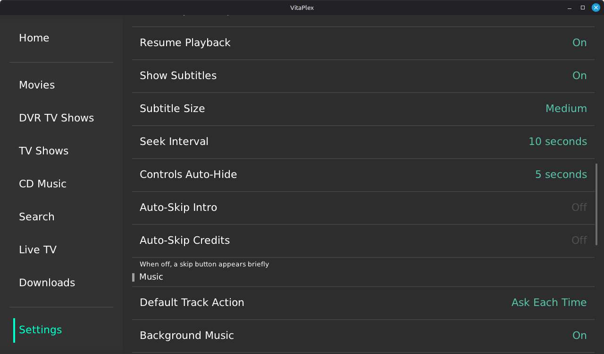</td>
  </tr>
    </tr>
   <tr>
    <td></td>
    <td>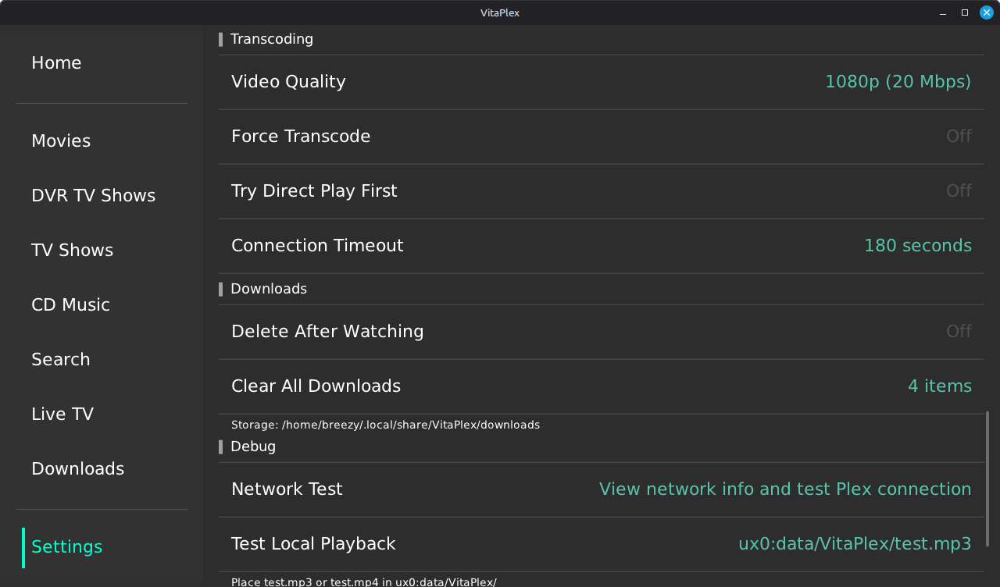</td>
  </tr>
</table>

